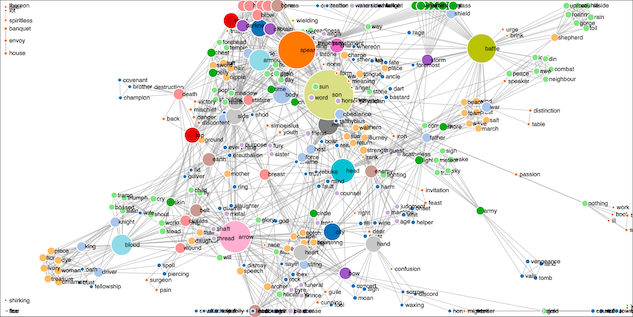
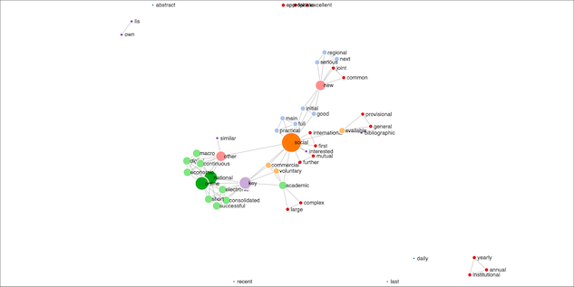

# Carrel2diagram

This repository is a fork of [Pearc19_team_jams](https://github.com/shivamriky/Pearc19_team_jams), the first place winner of the [PEARC '19 Hack-a-thon](https://sciencegateways.org/engage/hackathon) made up of Aarushi Bisht, Cheng Jial, Mel Mashiku, and Shivam Rastogi. Without their good work this cool hack would not exist. *Congratulations and thank you!*

## Introduction

Given the short name of a Distant Reader study carrel, create a network diagram and visualize it.

A system called [The Distant Reader](https://distantreader.org) takes an arbitrary amount of unstructured data (text) as input and outputs sets of structured data in the form of tab-delimited text files as well as a relational (SQLite) database file. This hack reads some of those tab-delimited text files, extracts the nouns, associates them with other nouns found in the same sentence, outputs the resulting network diagram in the form of a JSON file, and provides the means to visualize the graph in a Web browser. The result enables a person to literally see the relationships between things in a textual corpus.

Assuming your computer has Bash, Python, and a number of their friends already installed, here is how to get this hack to work for you:

1. browse the [collection of Distant Reader study carrels](http://carrels.distantreader.org)
2. identify a study carrel of interest
3. clone or download this repository
4. run [`./bin/build.sh`](./bin/build.sh) with the name of the study carrel
5. use your Web browser to open the newly created file in the `./html` directory

Below are two examples of the visualized output, one from the *Iliad &amp; the Odyssey*, and the other from a scholarly journal called *Ariadne*:

## What can go wrong &amp; under the hood

There are many things that can go wrong. First of all, you may not have Bash installed on your computer. Second, you may not have a few utilities installed on your computer, such as `wget` or `unzip`. Third, you may not have Python installed on your computer and/or you may not have the necessary modules installed. On the other hand, if you have gotten this far, then I think things ought to work. *Famous last words.*

Under the hood, `./bin/build.sh` calls two other scripts: 1) [`./bin/carrel2json.py`](./bin/carrel2json.py) and 2) [`./bin/template2html.sh`](./bin/template2html.sh). In conjunction with each other, this is how they work:

1. use wget to download the given study carrel
2. use unzip to... unzip the study carrel
3. read all the parts-of-speech files and insert each sentence into a data frame
4. find all the nouns in the data frame
5. find all the other nouns in the same sentence, and denote this as a relationship
6. in the form of a JSON file, output a network diagram describing the relationships
7. read an HTML template
8. substitute tokens found in the template for values describing the study carrel
9. save the updated HTML file
10. done 

## Customizations

This hack can be (easily) customized in a few ways:

1. First off all, you can change the value of POS found at the top of [`./bin/carrel2json.py`](./bin/carrel2json.py). The value of POS denotes the part-of-speech to extract from each sentence. Sensical values include: NN (nouns), NNP (proper nouns), and ADJ (adjectives). Thus, you can visualize who or what are mentioned in the same sentences or what adjectives are used together.

2. Second, you can edit the [HTML template](./etc/template.htm). For example, you might make the resulting HTML "responsive."

3. Third, you could make the resulting visualization more usable by editing [`./html/js/knowledge_graph.js`](./html/js/knowledge_graph.js). More specifically, the network diagram (JSON file) is read &amp; rendered by a Javascript library called [D3](https://d3js.org), and `./html/js/knowledge_graph.js` is used to specify characteristics of the visualization. For example, you could change the sizes &amp; colors of the diagram's nodes &amp; edges. You could denote the "gravity" between nodes. You could add buttons enabling somebody to navigate in &amp; around the graph.

## Future work

There are at least two things to do:

1. Team JAMS not only implemented a way to illustrate relationships between parts-of-speech, but they also documented ways to create models from the graphs for the purposes of generating new knowledge. This is described in their [final report](./etc/final-report.html), and creating such models is on the to-do list.

2. Next, I need/want to integrate this hack into the Distant Reader itself. More specifically, this hack can become one of automatically generated reports.

## Final note

Again, *"Thank you Team JAMS. This has been a lot of fun!"*

--- 
Eric Lease Morgan &lt;emorgan@nd.edu&gt;  
August 7, 2019

